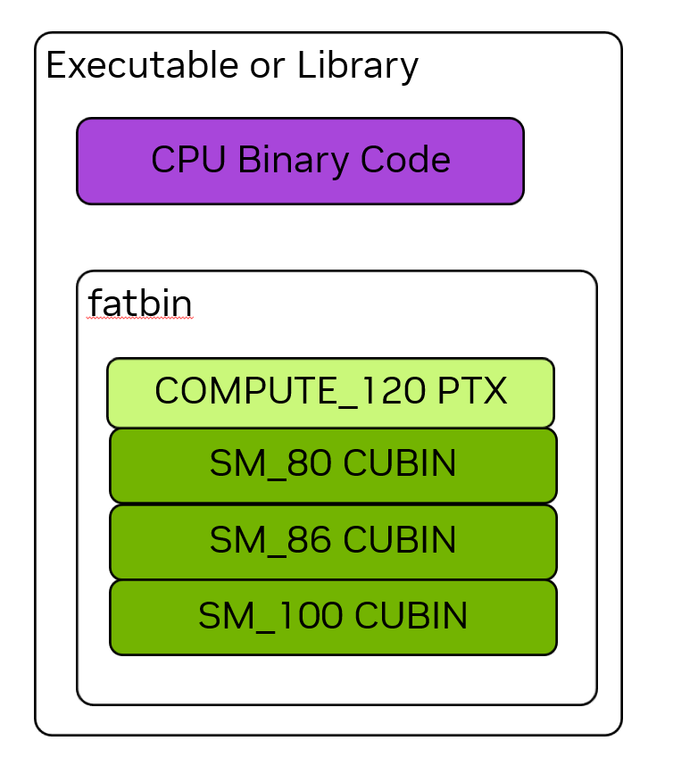

+++
date = '2026-02-09T19:09:50+08:00'
draft = false
title = 'CUDA二进制文件格式以及兼容性'
+++

## 可执行文件格式

一个由nvcc编译的可执行文件包含CPU binary code和Fat Binary (fatbin)两部分。fatbin是为兼容多版本GPU而设计的，一个fatbin包含多个CUDA Binary (cubin)或者PTX code。
- cubin：存储SASS码，是GPU实际执行的二进制码。
- PTX：可以被理解为一种IR，在SASS上提供一层抽象层，可被CUDA Driver的Just-in-time compilation (JIT)编译为SASS码。

## 兼容性

### cubin的兼容性
cubin的版本用`sm_<xx>`表示，能够兼容更新的小版本（Minor version）。例如，`sm_80`的二进制能够在计算能力（Compute capability）为8.6和8.9的GPU上运行，但不能在9.0的GPU上运行。

### PTX的兼容性
ptx的版本用`compute_<xx>`表示，能够兼容更新的所有版本。例如，`compute_80`的二进制能够在8.6和12.0的GPU上运行。

## 参考资料
- *NVIDIA GPU所有GPU的运算能力表格*：https://developer.nvidia.com/cuda/gpus
- *CUDA Programming Guide 1.3 The CUDA Platform*: https://docs.nvidia.com/cuda/cuda-programming-guide/01-introduction/cuda-platform.html